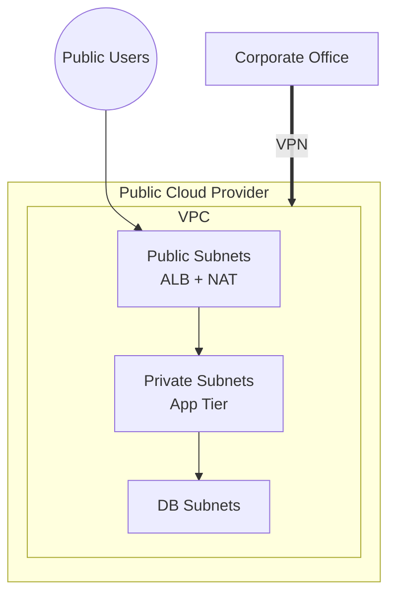
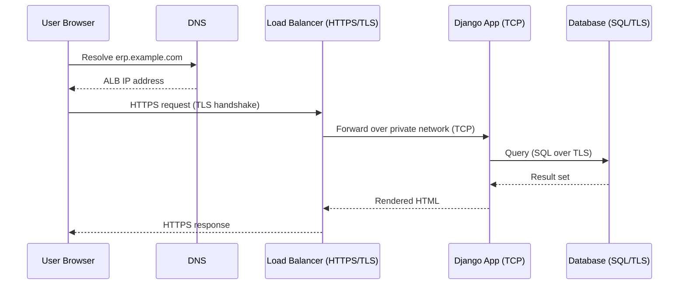

# Cloud Strategy

> BTEC Unit 6 — Learning Aim A
> Criteria covered: **A.P1, A.P2, A.M1, A.D1**
> Application context: Cloud ERP Platform (Django CRM + ERP + WMS)

This document explains the cloud networking architectures, networking standards,
cloud communication methods and their impact on performance for the Cloud ERP
Platform, and justifies the chosen design.

---

## Criterion Coverage Map

| Criterion | Requirement | Section |
|-----------|-------------|---------|
| **A.P1** | Explain cloud networking architectures and how they support an organisation | §1, §2 |
| **A.P2** | Explain networking standards and protocols used in cloud communication | §3, §4 |
| **A.M1** | Assess how cloud architectures and standards support performance and communication | §5 |
| **A.D1** | Evaluate and justify the cloud networking solution for the organisation | §6 |

---

## 1. Cloud Networking Architectures (A.P1)

Cloud networking is the practice of hosting an organisation's network resources
(compute, storage, routing, security) on a cloud provider's infrastructure
rather than on physical hardware on-premises. The Cloud ERP Platform uses a
**Virtual Private Cloud (VPC)** architecture.

### 1.1 Common cloud architecture models

| Architecture | Description | Suitability for ERP platform |
|--------------|-------------|------------------------------|
| **Public cloud** | Resources fully hosted by a cloud provider, shared infrastructure. | Cost-effective, elastic — chosen base model. |
| **Private cloud** | Dedicated infrastructure for one organisation. | High control but high cost; overkill here. |
| **Hybrid cloud** | Mix of cloud + on-premise, joined by VPN. | Used partially — VPN links office to VPC. |
| **Multi-cloud** | Multiple providers to avoid lock-in. | Not required at current scale. |

### 1.2 Chosen architecture: VPC on public cloud + hybrid VPN

The platform uses a **single-region, multi-AZ VPC** (see `NETWORK_DESIGN.md`):

- Public subnets host the load balancer and NAT gateway.
- Private subnets host the Django application servers (CRM/ERP/WMS).
- Database subnets are fully isolated.
- A site-to-site VPN connects the corporate office (hybrid element).

### 1.3 How it supports the organisation

- **Elasticity** — capacity grows/shrinks with demand (Auto Scaling).
- **Cost model** — pay-as-you-go instead of capital hardware spend.
- **Resilience** — multi-AZ removes single points of failure.
- **Global reach** — users can access the ERP from anywhere over HTTPS.
- **Separation of concerns** — CRM, ERP and WMS share infrastructure while
  staying logically isolated by application design.

---

## 2. Service Models Supporting the Platform (A.P1)

| Model | Definition | Use in this project |
|-------|------------|---------------------|
| **IaaS** | Infrastructure as a Service — VMs, networking, storage. | VPC, subnets, app servers. |
| **PaaS** | Platform as a Service — managed runtime. | Managed database, managed load balancer. |
| **SaaS** | Software as a Service — delivered application. | The ERP Platform itself, delivered to end users. |

The platform is **delivered as SaaS** to its users, **built on PaaS** managed
services, which themselves run on **IaaS** networking.

---

## 3. Networking Standards (A.P2)

The cloud communication relies on established standards and protocols:

| Layer | Standard / Protocol | Role in the platform |
|-------|---------------------|----------------------|
| Application | **HTTP/HTTPS (TLS 1.2/1.3)** | Browser ↔ Django over the ALB. |
| Application | **DNS** | Resolves `erp.example.com` to the ALB. |
| Transport | **TCP** | Reliable delivery for web + DB traffic. |
| Transport | **TLS/SSL** | Encryption of data in transit. |
| Network | **IPv4 / CIDR** | VPC `10.0.0.0/16` addressing and subnetting. |
| Network | **IPsec** | Site-to-site VPN tunnel encryption. |
| Routing | **BGP** (optional) | Dynamic route exchange over the VPN. |
| Data | **SQL / TLS** | App ↔ database communication. |

### 3.1 Addressing and subnetting standard (CIDR)

The VPC follows RFC 1918 private addressing using CIDR notation:

| Block | Hosts | Purpose |
|-------|-------|---------|
| `10.0.0.0/16` | 65,536 | Whole VPC |
| `10.0.1.0/24` | 256 | Public subnet |
| `10.0.11.0/24` | 256 | Private subnet |

---

## 4. Cloud Communication (A.P2)

Communication types used:

- **North-south traffic** — users ↔ application (HTTPS through ALB).
- **East-west traffic** — app ↔ database within private subnets (TCP/SQL).
- **Hybrid traffic** — office ↔ VPC over IPsec VPN.
- **Egress traffic** — app → internet through NAT for updates.

---

## 5. Impact on Performance (A.M1)

Assessment of how the architecture and standards affect performance and
communication:

| Factor | Positive impact | Trade-off / risk |
|--------|-----------------|------------------|
| **Load balancing** | Spreads load, removes bottleneck, enables HA. | Adds a small latency hop; needs health checks. |
| **Multi-AZ** | Survives an AZ outage. | Cross-AZ traffic adds latency/cost. |
| **TLS everywhere** | Confidentiality + integrity. | Handshake/CPU overhead (mitigated by session reuse). |
| **Private subnets + NAT** | Strong isolation. | NAT can become a throughput bottleneck for heavy egress. |
| **DNS-based routing** | Fast failover, geo-routing. | TTL caching can delay failover. |
| **TCP + connection pooling** | Reliable, efficient DB access. | Too many connections can exhaust DB limits. |

### 5.1 Performance characteristics

| Metric | Without cloud design | With this cloud design |
|--------|----------------------|------------------------|
| Single point of failure | Yes (one server) | No (multi-AZ + ALB) |
| Horizontal scaling | Manual | Automatic (ASG) |
| Latency under load | Degrades sharply | Stable (load distributed) |
| Recovery from failure | Manual rebuild | Automatic replacement |

**Assessment:** the combination of load balancing, multi-AZ deployment and
standard protocols (HTTPS/TLS, TCP, DNS) directly improves throughput,
availability and security of communication, at the cost of minor added latency
and complexity that are well justified for a business-critical ERP.

---

## 6. Evaluation and Justification (A.D1)

### 6.1 Why this solution over alternatives

| Option | Verdict | Reasoning |
|--------|---------|-----------|
| On-premise only | Rejected | High capex, poor scalability, single site risk. |
| Public cloud VPC (chosen) | **Selected** | Elastic, resilient, pay-as-you-go, fast to deploy. |
| Full private cloud | Rejected | Cost not justified at current scale. |
| Multi-cloud | Deferred | Operational complexity outweighs benefit for now. |

### 6.2 Justification against organisational needs

- **Business continuity:** multi-AZ + ALB + DB standby meet the requirement for
  the CRM/ERP/WMS platform to stay online during failures.
- **Security & compliance:** private subnets, NACLs, security groups, IAM and
  TLS satisfy data-protection obligations (detailed in
  `INFRASTRUCTURE_SECURITY.md`).
- **Cost efficiency:** Auto Scaling means the organisation pays only for the
  capacity it uses, important for a growing business.
- **Performance:** load balancing and CDN/caching (see `TECH_OPTIMIZATION.md`)
  keep response times low as user numbers grow.
- **Future growth:** the VPC design can extend to additional regions or a
  multi-cloud model without re-architecting the application.

### 6.3 Conclusion

The VPC-based public-cloud architecture with a hybrid VPN is the most
appropriate solution for the organisation. It balances cost, security,
performance and scalability, uses widely supported open standards, and directly
supports the CRM, ERP and WMS workloads. The design is therefore both
technically sound and commercially justified.
