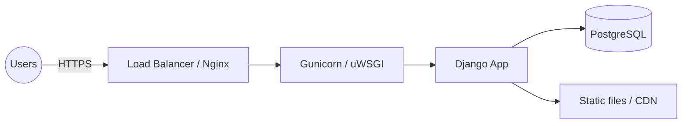
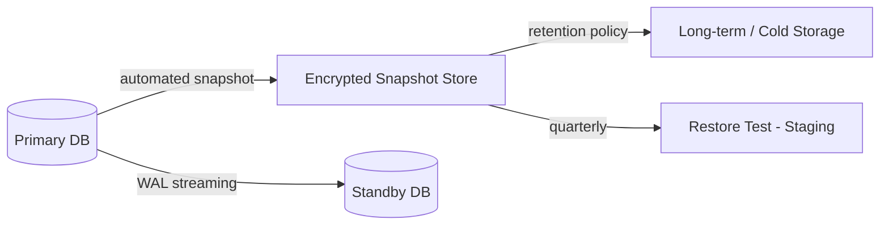

# Deployment Guide

> Deployment instructions for the Cloud ERP Platform (Django CRM + ERP + WMS).

Covers local development deployment, production deployment, security
considerations and a backup strategy.

---

## 1. Local Deployment

### 1.1 Prerequisites

| Requirement | Notes |
|-------------|-------|
| Python 3.x | `python --version` |
| Django | Installed in a virtual environment |
| Git | To clone/manage the repository |

### 1.2 Steps

```bash
# 1. (Optional) create & activate a virtual environment
python -m venv venv
venv\Scripts\activate        # Windows
# source venv/bin/activate   # macOS / Linux

# 2. Install dependencies
pip install django

# 3. Apply migrations
python manage.py makemigrations
python manage.py migrate

# 4. Create demo admin + sample data (no manual input required)
python manage.py seed_data

# 5. Run the development server
python manage.py runserver
```

Then browse to <http://127.0.0.1:8000/> and log in with **admin /
Admin@2026ERP**.

### 1.3 Verification

```bash
python manage.py check
```

Expected output: `System check identified no issues`.

---

## 2. Production Deployment

> The development server (`runserver`) must **not** be used in production.

### 2.1 Recommended stack



| Component | Recommended |
|-----------|-------------|
| WSGI server | Gunicorn or uWSGI |
| Reverse proxy | Nginx (TLS termination, static files) |
| Database | PostgreSQL (instead of SQLite) |
| Static files | `collectstatic` → CDN / object storage |
| Process manager | systemd / supervisor / container orchestrator |

### 2.2 Production settings changes

Update `settings.py` (ideally via environment variables):

```python
import os

DEBUG = False
ALLOWED_HOSTS = ['erp.example.com']
SECRET_KEY = os.environ['DJANGO_SECRET_KEY']

DATABASES = {
    'default': {
        'ENGINE': 'django.db.backends.postgresql',
        'NAME': os.environ['DB_NAME'],
        'USER': os.environ['DB_USER'],
        'PASSWORD': os.environ['DB_PASSWORD'],
        'HOST': os.environ['DB_HOST'],
        'PORT': '5432',
    }
}

SECURE_SSL_REDIRECT = True
SESSION_COOKIE_SECURE = True
CSRF_COOKIE_SECURE = True
SECURE_HSTS_SECONDS = 31536000
STATIC_ROOT = BASE_DIR / 'staticfiles'
```

### 2.3 Production deployment steps

```bash
# 1. Install dependencies (incl. gunicorn, psycopg)
pip install django gunicorn psycopg[binary]

# 2. Set environment variables (DJANGO_SECRET_KEY, DB_*, etc.)

# 3. Migrate and collect static
python manage.py migrate
python manage.py collectstatic --noinput

# 4. Create the admin (seed_data) or a real superuser
python manage.py seed_data

# 5. Start the app server
gunicorn cloud_erp_platform.wsgi:application --bind 0.0.0.0:8000 --workers 3
```

Nginx terminates TLS and proxies to Gunicorn; static files are served from
`STATIC_ROOT` / CDN.

> Maps to the cloud architecture in `NETWORK_DESIGN.md` and
> `TECH_OPTIMIZATION.md` (load balancer, Auto Scaling, CDN).

---

## 3. Security Considerations

| Area | Action |
|------|--------|
| Debug | `DEBUG = False` in production |
| Secret key | From environment / secrets manager, never committed |
| Allowed hosts | Restrict `ALLOWED_HOSTS` to real domains |
| HTTPS | Force TLS (`SECURE_SSL_REDIRECT`, HSTS) |
| Cookies | `SESSION_COOKIE_SECURE`, `CSRF_COOKIE_SECURE` |
| Demo password | Change `Admin@2026ERP` before/after first production login |
| Database | Private subnet, no public access (see `INFRASTRUCTURE_SECURITY.md`) |
| Network | Security groups, NACLs, WAF, VPN for admin |
| Updates | Keep Django + OS patched |

Full detail in [INFRASTRUCTURE_SECURITY.md](INFRASTRUCTURE_SECURITY.md).

---

## 4. Backup Strategy

| Item | Strategy | Frequency |
|------|----------|-----------|
| Database | Automated encrypted snapshots + point-in-time recovery | Daily + continuous WAL |
| Media/static | Versioned object storage | On change |
| Configuration | Stored in version control (no secrets) | On change |
| Secrets | Secrets manager with versioning | On rotation |
| Restore tests | Periodically restore to a staging environment | Quarterly |

### 4.1 Manual database backup (dev)

```bash
# SQLite (development) - just copy the file
copy db.sqlite3 backups\db-backup.sqlite3        # Windows

# Django data dump (any backend)
python manage.py dumpdata > backups\data.json
python manage.py loaddata backups\data.json      # restore
```

### 4.2 Production backup flow



| Principle | Implementation |
|-----------|----------------|
| 3-2-1 rule | 3 copies, 2 media types, 1 offsite |
| Encryption | AES-256 on all backups |
| Retention | Daily 30d, weekly 12w, monthly 12m |
| Recovery objective | RPO ≤ 24h, RTO ≤ 1h (with standby) |

---

## 5. Deployment Checklist

- [ ] `DEBUG = False`
- [ ] `SECRET_KEY` from environment
- [ ] `ALLOWED_HOSTS` configured
- [ ] PostgreSQL configured and reachable (private subnet)
- [ ] `migrate` run successfully
- [ ] `collectstatic` run
- [ ] Admin account created / demo password changed
- [ ] HTTPS + secure cookies enabled
- [ ] Backups scheduled and a restore tested
- [ ] Monitoring/alerts configured (see `TECH_OPTIMIZATION.md`)
