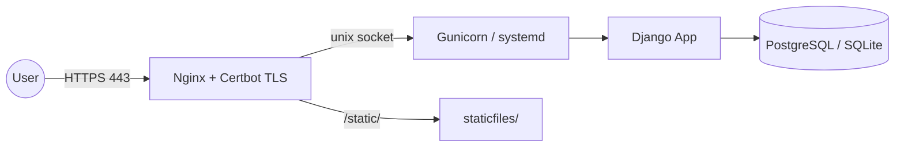

# Deploying the Cloud ERP Platform to AWS EC2

> End-to-end guide to deploy the Django CRM/ERP/WMS platform on an Ubuntu EC2
> instance with Gunicorn, Nginx and HTTPS (Let's Encrypt / Certbot).

Stack: **Ubuntu 22.04/24.04 → Python venv → Gunicorn (systemd) → Nginx reverse
proxy → Certbot TLS**. PostgreSQL is optional (SQLite works for a demo).



Paths in this guide assume the project lives at `/home/ubuntu/Networking`.
Adjust if you clone elsewhere.

---

## 1. Launch & Prepare the EC2 Instance

1. Launch an **Ubuntu Server** EC2 instance (t3.small or larger recommended).
2. In the **Security Group**, allow inbound:
   - **SSH (22)** from your IP
   - **HTTP (80)** from anywhere
   - **HTTPS (443)** from anywhere
3. Associate an **Elastic IP** (so the public IP is stable for DNS).
4. Point your domain's **DNS A record** at the Elastic IP.

SSH in:

```bash
ssh -i your-key.pem ubuntu@YOUR_EC2_PUBLIC_IP
```

---

## 2. Ubuntu System Setup

```bash
sudo apt update && sudo apt upgrade -y
sudo apt install -y python3 python3-venv python3-pip git nginx
# Optional: PostgreSQL server + client libraries
sudo apt install -y postgresql postgresql-contrib libpq-dev
```

---

## 3. (Optional) PostgreSQL Database

Skip this section to use SQLite. For PostgreSQL:

```bash
sudo -u postgres psql <<'SQL'
CREATE DATABASE cloud_erp;
CREATE USER cloud_erp WITH PASSWORD 'replace-with-db-password';
ALTER ROLE cloud_erp SET client_encoding TO 'utf8';
ALTER ROLE cloud_erp SET default_transaction_isolation TO 'read committed';
ALTER ROLE cloud_erp SET timezone TO 'UTC';
GRANT ALL PRIVILEGES ON DATABASE cloud_erp TO cloud_erp;
\q
SQL
```

---

## 4. Clone the Project (Git)

```bash
cd /home/ubuntu
git clone <YOUR_REPOSITORY_URL> Networking
cd Networking
```

---

## 5. Python Virtual Environment & Dependencies

```bash
cd /home/ubuntu/Networking
python3 -m venv venv
source venv/bin/activate
pip install --upgrade pip
pip install -r requirements.txt
```

---

## 6. Environment Configuration (.env)

```bash
cp .env.example .env
nano .env
```

Set at minimum:

```ini
DJANGO_SECRET_KEY=<a long random string>
DJANGO_DEBUG=False
DJANGO_ALLOWED_HOSTS=your-domain.com,www.your-domain.com,YOUR_EC2_PUBLIC_IP
DJANGO_CSRF_TRUSTED_ORIGINS=https://your-domain.com,https://www.your-domain.com
# For PostgreSQL (omit / set DB_ENGINE=sqlite to use SQLite):
DB_ENGINE=postgres
DB_NAME=cloud_erp
DB_USER=cloud_erp
DB_PASSWORD=replace-with-db-password
DB_HOST=localhost
DB_PORT=5432
```

Generate a secret key:

```bash
python -c "from django.core.management.utils import get_random_secret_key; print(get_random_secret_key())"
```

> The `.env` file is git-ignored. Never commit real secrets.

---

## 7. Migrate, Seed & Collect Static

```bash
source venv/bin/activate
python manage.py migrate
python manage.py collectstatic --noinput

# Create the demo admin + sample data (admin / Admin@2026ERP)
python manage.py seed_data
#   --- or create your own superuser instead ---
# python manage.py createsuperuser

# Sanity check
python manage.py check --deploy
```

`collectstatic` writes to `staticfiles/` (configured as `STATIC_ROOT`).
WhiteNoise compresses and hashes these assets automatically.

---

## 8. Gunicorn as a systemd Service

A ready-made unit file is provided at `deploy/cloud_erp.service` and a Gunicorn
config at `gunicorn.conf.py` (binds the `unix:/run/cloud_erp.sock` socket).

```bash
sudo cp /home/ubuntu/Networking/deploy/cloud_erp.service /etc/systemd/system/cloud_erp.service
sudo systemctl daemon-reload
sudo systemctl enable --now cloud_erp
sudo systemctl status cloud_erp
```

Test the socket locally:

```bash
curl --unix-socket /run/cloud_erp.sock http://localhost/login/ -I
```

After future code changes:

```bash
cd /home/ubuntu/Networking && source venv/bin/activate
git pull
pip install -r requirements.txt
python manage.py migrate
python manage.py collectstatic --noinput
sudo systemctl restart cloud_erp
```

---

## 9. Nginx Reverse Proxy

An example config is provided at `deploy/nginx.conf.example`.

```bash
sudo cp /home/ubuntu/Networking/deploy/nginx.conf.example /etc/nginx/sites-available/cloud_erp
# Edit server_name to your real domain:
sudo nano /etc/nginx/sites-available/cloud_erp

sudo ln -s /etc/nginx/sites-available/cloud_erp /etc/nginx/sites-enabled/
sudo rm -f /etc/nginx/sites-enabled/default   # remove the default site
sudo nginx -t
sudo systemctl reload nginx
```

Visit `http://your-domain.com/` — the app should load over HTTP.

---

## 10. HTTPS with Certbot (Let's Encrypt)

```bash
sudo apt install -y certbot python3-certbot-nginx
sudo certbot --nginx -d your-domain.com -d www.your-domain.com
```

Certbot obtains the certificate, edits the Nginx config to add the HTTPS (443)
server block, and sets up an HTTP→HTTPS redirect.

Verify automatic renewal:

```bash
sudo certbot renew --dry-run
```

Because `DJANGO_DEBUG=False`, the production security settings activate
automatically (`SECURE_SSL_REDIRECT`, HSTS, secure cookies, and trusting the
`X-Forwarded-Proto` header from Nginx).

---

## 11. Post-Deployment Checklist

- [ ] `DJANGO_DEBUG=False` in `.env`
- [ ] `DJANGO_SECRET_KEY` is a fresh random value
- [ ] `DJANGO_ALLOWED_HOSTS` includes your domain + EC2 IP
- [ ] `python manage.py check --deploy` reports no critical issues
- [ ] `collectstatic` run; `/static/` assets load
- [ ] Gunicorn service active: `systemctl status cloud_erp`
- [ ] Nginx config valid: `nginx -t`
- [ ] HTTPS works and HTTP redirects to HTTPS
- [ ] Admin login works at `/admin/`
- [ ] Demo password `Admin@2026ERP` changed for any real use
- [ ] Database backups scheduled (see `DEPLOYMENT_GUIDE.md` §4)

---

## 12. Troubleshooting

| Symptom | Likely cause | Fix |
|---------|--------------|-----|
| 502 Bad Gateway | Gunicorn down / wrong socket | `systemctl status cloud_erp`; check `bind` in `gunicorn.conf.py` matches Nginx `upstream` |
| 400 Bad Request | Host not in `ALLOWED_HOSTS` | Add domain/IP to `DJANGO_ALLOWED_HOSTS` and restart |
| CSRF verification failed | Missing trusted origin | Set `DJANGO_CSRF_TRUSTED_ORIGINS` to your `https://` domain |
| Static files 404 / unstyled | `collectstatic` not run / wrong alias | Run `collectstatic`; check Nginx `/static/` `alias` path |
| Permission denied on socket | User/group mismatch | Ensure service `User`/`Group` and `RuntimeDirectory` are correct |
| Cert fails | DNS not pointing to EC2 / port 80 blocked | Confirm A record + security group allows 80/443 |

View logs:

```bash
sudo journalctl -u cloud_erp -f        # Gunicorn/app logs
sudo tail -f /var/log/nginx/error.log  # Nginx logs
```

---

## 13. Files Used in This Deployment

| File | Purpose |
|------|---------|
| `requirements.txt` | Python dependencies (Django, Gunicorn, WhiteNoise, dotenv, psycopg) |
| `.env.example` | Template for production environment variables |
| `cloud_erp_platform/settings.py` | Reads env vars; WhiteNoise; `STATIC_ROOT`; security settings |
| `gunicorn.conf.py` | Gunicorn worker/socket/logging config |
| `deploy/cloud_erp.service` | systemd unit for Gunicorn |
| `deploy/nginx.conf.example` | Nginx reverse-proxy site config |
| `.gitignore` | Keeps `.env`, `db.sqlite3`, `staticfiles/`, `venv/` out of git |

See also [DEPLOYMENT_GUIDE.md](DEPLOYMENT_GUIDE.md) for the general
production/backup overview and [INFRASTRUCTURE_SECURITY.md](INFRASTRUCTURE_SECURITY.md)
for the security model.
