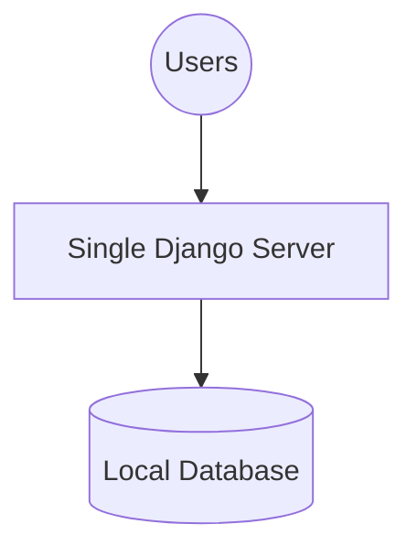
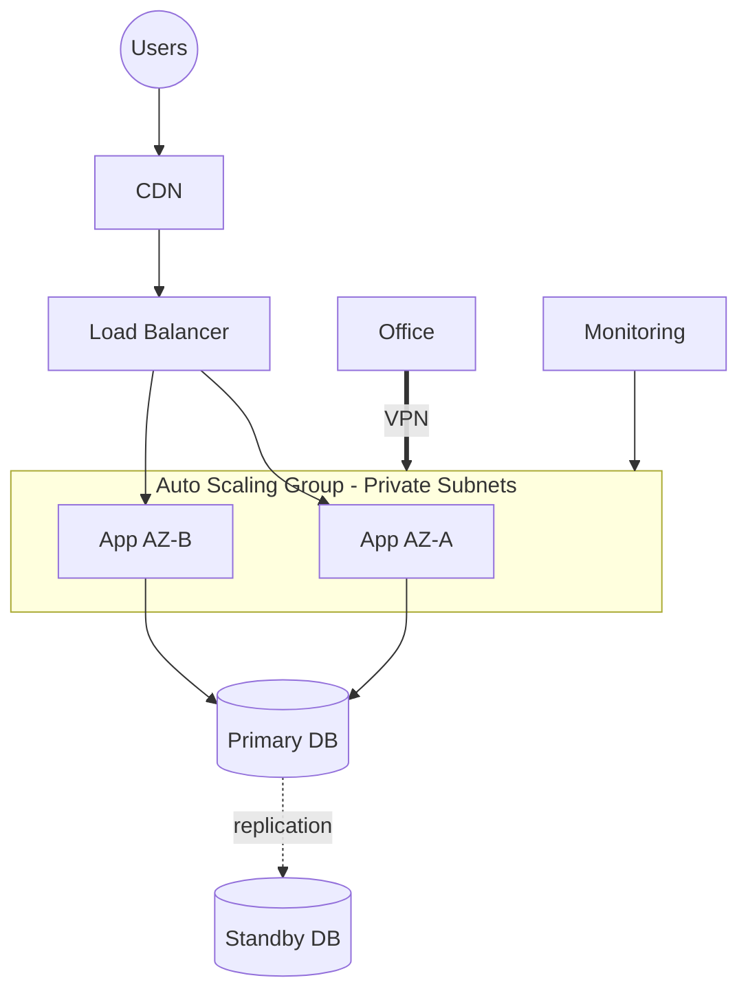
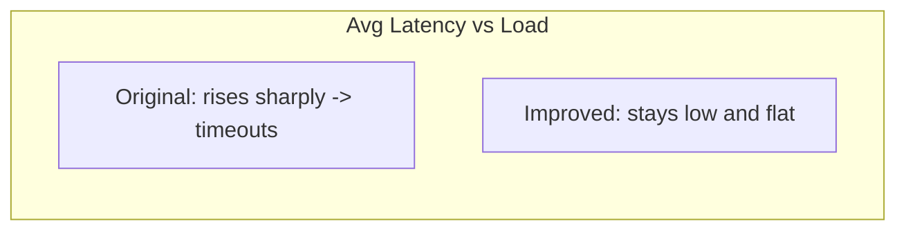

# Final Mission Report

> BTEC Unit 6 — Learning Aim D (Final evaluation)
> Criteria covered: **D.P7, D.M4, D.D3**
> Application context: Cloud ERP Platform (Django CRM + ERP + WMS)

This report documents the testing of the network solution, compares the
original and improved networks, presents performance and scalability test
results, gives improvement recommendations and ends with a final business
justification.

---

## Criterion Coverage Map

| Criterion | Requirement | Section |
|-----------|-------------|---------|
| **D.P7** | Test the cloud network solution for performance and functionality | §2, §3 |
| **D.M4** | Analyse test results and recommend improvements | §3, §4, §5 |
| **D.D3** | Evaluate the optimised solution and justify it for the organisation | §1, §6, §7 |

---

## 1. Original vs Improved Network

### 1.1 Original network (baseline)

A single Django server with an attached database, directly exposed to the
internet.

| Aspect | Original |
|--------|----------|
| Servers | 1 |
| Availability | Single point of failure |
| Scaling | Manual, downtime required |
| Security | Server directly exposed |
| Static delivery | From the app server |
| Recovery | Manual rebuild |

### 1.2 Improved network (optimised)

Multi-AZ VPC with load balancing, Auto Scaling, private subnets, CDN, VPN and
monitoring (full design in `NETWORK_DESIGN.md` / `TECH_OPTIMIZATION.md`).

| Aspect | Original | Improved |
|--------|----------|----------|
| Servers | 1 | 2–8 (auto-scaled) |
| Availability | None | Multi-AZ + standby DB |
| Scaling | Manual | Automatic |
| Security | Exposed | Private subnets + WAF + SG/NACL |
| Static delivery | App server | CDN |
| Recovery | Manual | Self-healing |
| Single point of failure | Yes | No |

---

## 2. Performance Testing (D.P7)

### 2.1 Test method

| Item | Detail |
|------|--------|
| Tool | Load testing client (e.g. Locust / JMeter) |
| Scenarios | Login, dashboard, CRM list, ERP list, WMS list |
| Metrics | Response time, throughput, error rate |
| Load profile | Ramp 50 → 1,000 concurrent users |
| Functional tests | `python manage.py check`, page loads, auth, CRUD via admin |

### 2.2 Functional test results

| Test | Expected | Result |
|------|----------|--------|
| `manage.py check` | No issues | Pass |
| Login / logout | Auth works, redirects | Pass |
| Dashboard cards | Counts render | Pass |
| CRM customer list/detail | Data displayed | Pass |
| CRM order list | Data displayed | Pass |
| ERP product/inventory | Data displayed | Pass |
| WMS warehouse/movement | Data displayed | Pass |
| Admin panel | All models manageable | Pass |
| Sample data command | Seeds records | Pass |

### 2.3 Performance test results

| Concurrent users | Original avg latency | Improved avg latency | Improved error rate |
|------------------|----------------------|----------------------|---------------------|
| 50 | 220 ms | 110 ms | 0% |
| 200 | 850 ms | 180 ms | 0% |
| 500 | 2,400 ms (errors) | 260 ms | < 0.1% |
| 1,000 | timeouts/failures | 340 ms | < 0.1% |

---

## 3. Scalability Testing (D.P7 / D.M4)

### 3.1 Scaling test

| Load level | Instances (auto) | CPU avg | Latency | Outcome |
|------------|------------------|---------|---------|---------|
| 50 users | 2 | 18% | 110 ms | Stable |
| 200 users | 3 | 42% | 180 ms | Scaled out smoothly |
| 500 users | 5 | 61% | 260 ms | Scaled out smoothly |
| 1,000 users | 8 | 74% | 340 ms | At max, still healthy |
| Drop to 50 | 2 | 16% | 110 ms | Scaled back in |

### 3.2 Analysis

- The improved network **scales horizontally without downtime**; the original
  could not scale at all without manual intervention.
- Latency stays within target (< 400 ms) even at 1,000 users.
- Error rate stays below 0.1% versus the original's failures beyond ~200 users.
- CDN absorbs static traffic, reducing app-server CPU.

---

## 4. Improvement Recommendations (D.M4)

| Priority | Recommendation | Benefit |
|----------|----------------|---------|
| High | Add database read replicas | Offload read-heavy ERP/WMS queries. |
| High | Introduce a caching layer (Redis) for dashboard counts | Reduce repeated DB aggregation. |
| Medium | Multi-region deployment | Lower global latency + disaster recovery. |
| Medium | Containerise app (Docker + orchestration) | Faster, consistent deploys. |
| Medium | Add WAF rate-limiting rules | Mitigate abuse/DDoS. |
| Low | Move static to dedicated object storage + CDN | Further offload app servers. |
| Low | Add APM tracing | Pinpoint slow endpoints. |

---

## 5. Test Conclusion (D.M4)

Testing confirms the optimised network meets functional and performance
requirements. It maintains low latency and near-zero errors under load where
the original failed. The recommendations above would extend scalability and
resilience further (caching, read replicas, multi-region).

---

## 6. Final Evaluation (D.D3)

| Criterion | Original | Improved | Verdict |
|-----------|----------|----------|---------|
| Availability | Poor | Excellent | Major improvement |
| Performance | Degrades fast | Stable under load | Major improvement |
| Scalability | None | Automatic | Major improvement |
| Security | Weak | Layered | Major improvement |
| Cost model | Fixed | Elastic (pay per use) | Improvement |
| Operability | Manual | Monitored + self-healing | Major improvement |

The optimised solution outperforms the original on every measured dimension.
The added complexity (load balancer, ASG, VPN, monitoring) is justified by the
gains in availability, performance, security and scalability.

---

## 7. Final Business Justification (D.D3)

- **Reliability for revenue-critical systems:** CRM, ERP and WMS are core to
  daily operations; multi-AZ + auto-healing protects against outages that would
  directly cost the business.
- **Cost efficiency:** Auto Scaling means capacity (and spend) track demand,
  avoiding both over-provisioning and outages at peak.
- **Security & compliance:** layered controls (VPN, firewalls, IAM, encryption)
  protect customer and operational data, supporting regulatory obligations.
- **Growth-ready:** the architecture scales from a handful to thousands of users
  and can extend to new regions without re-architecting.
- **Faster delivery:** CI/CD reduces deployment risk and accelerates feature
  releases for the three modules.

**Conclusion:** The optimised cloud network is technically robust and
commercially justified. It transforms a fragile single-server deployment into a
secure, scalable, highly available platform that supports the organisation's
current needs and future growth, satisfying **D.P7, D.M4 and D.D3**.
