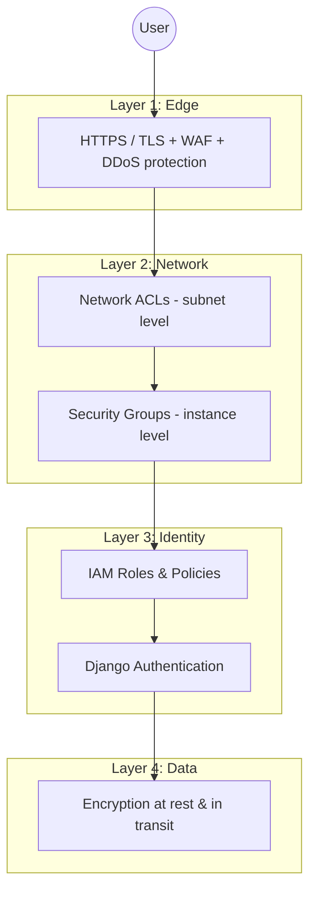
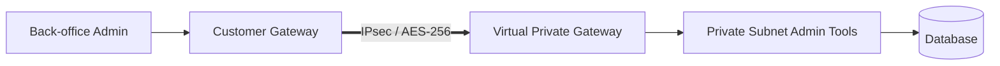
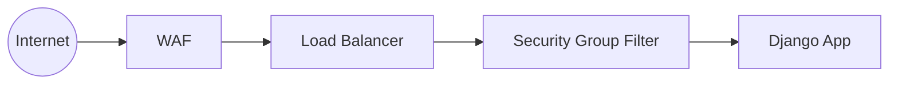
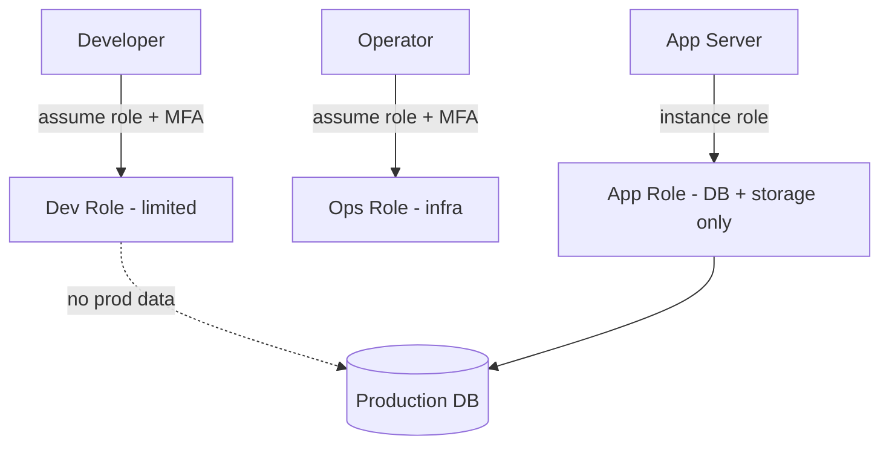
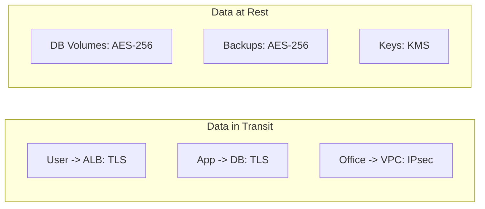

# Infrastructure Security

> BTEC Unit 6 — Learning Aim B/C (Security of the cloud network infrastructure)
> Application context: Cloud ERP Platform (Django CRM + ERP + WMS)

This document describes how the Cloud ERP Platform's infrastructure is secured,
covering VPN, firewalls, IAM, security groups, network ACLs, encryption and
cloud security best practices.

---

## 1. Security Model Overview

The platform uses **defence in depth** — multiple independent layers so that a
failure in one control does not compromise the whole system.

| Layer | Control | Scope |
|-------|---------|-------|
| Edge | TLS, WAF, DDoS protection | Internet boundary |
| Network | NACLs, Security Groups | Subnet & instance |
| Identity | IAM, Django auth | Access control |
| Data | Encryption, key management | Stored & transmitted data |

---

## 2. VPN

A **site-to-site IPsec VPN** secures traffic between the corporate office and
the VPC so administrative and back-office traffic never traverses the public
internet in clear text.

| Property | Value |
|----------|-------|
| Type | Site-to-site IPsec |
| Encryption | AES-256 |
| Integrity | SHA-256 |
| Key exchange | IKEv2 |
| Tunnels | 2 redundant tunnels (HA) |
| Authorised networks | Office `192.168.0.0/16` ↔ VPC `10.0.0.0/16` |

A **client VPN** can additionally be used for remote administrators, requiring
certificate-based authentication before reaching private resources.

---

## 3. Firewall

Firewalling is applied at several points:

| Firewall type | Layer | Purpose |
|---------------|-------|---------|
| Web Application Firewall (WAF) | L7 | Blocks SQLi, XSS, common web attacks before the ALB. |
| Stateful security groups | L4 | Per-instance allow rules. |
| Stateless NACLs | L4 | Per-subnet allow/deny rules. |
| Host firewall | OS | Last-resort local rules on app servers. |

---

## 4. IAM (Identity & Access Management)

IAM enforces **least privilege** — every identity gets only the permissions it
needs.

| Principle | Implementation |
|-----------|----------------|
| Least privilege | Scoped roles per service (app role, DB-admin role, CI/CD role). |
| Role-based access | Humans assume roles, not long-lived keys. |
| MFA | Required for all console/admin users. |
| Service roles | App servers use an instance role to reach managed services — no hard-coded secrets. |
| Separation of duties | Developers cannot access production data directly. |

### Application-level identity (Django)

- Django's authentication system protects every view (`@login_required`).
- Passwords hashed with PBKDF2 (Django default).
- Admin panel restricted to staff/superusers.
- Session cookies flagged `Secure` + `HttpOnly` in production.

---

## 5. Security Groups

Security groups are **stateful instance-level firewalls**. Return traffic is
automatically allowed.

| Security Group | Inbound | Source | Outbound |
|----------------|---------|--------|----------|
| `sg-alb` | 443, 80 | `0.0.0.0/0` | to `sg-app` |
| `sg-app` | 8000 (app) | `sg-alb` only | to `sg-db`, NAT |
| `sg-db` | 5432 (DB) | `sg-app` only | none |
| `sg-bastion` | 22 (SSH) | office/VPN IP only | to `sg-app` |

Key point: the database security group only accepts connections **from the
application security group**, never from the internet.

---

## 6. Network ACLs (NACLs)

NACLs are **stateless subnet-level filters** providing a coarse second layer
beneath security groups.

| NACL | Rule # | Type | Action | CIDR |
|------|--------|------|--------|------|
| Public NACL | 100 | HTTPS 443 in | ALLOW | `0.0.0.0/0` |
| Public NACL | 110 | HTTP 80 in | ALLOW | `0.0.0.0/0` |
| Public NACL | 32767 | All | DENY | `0.0.0.0/0` |
| Private NACL | 100 | From VPC | ALLOW | `10.0.0.0/16` |
| Private NACL | 110 | Ephemeral in | ALLOW | `0.0.0.0/0` |
| DB NACL | 100 | DB port from app subnets | ALLOW | `10.0.11.0/24`,`10.0.12.0/24` |
| DB NACL | 32767 | All | DENY | `0.0.0.0/0` |

| | Security Group | NACL |
|---|----------------|------|
| Scope | Instance | Subnet |
| State | Stateful | Stateless |
| Rules | Allow only | Allow + Deny |

---

## 7. Encryption

| State | Mechanism | Detail |
|-------|-----------|--------|
| In transit (user) | TLS 1.2/1.3 | HTTPS terminated at ALB. |
| In transit (internal) | TLS | App ↔ DB encrypted connections. |
| In transit (hybrid) | IPsec AES-256 | VPN tunnels. |
| At rest (DB) | AES-256 | Encrypted database volumes. |
| At rest (storage/backups) | AES-256 | Encrypted object storage + snapshots. |
| Key management | KMS / managed keys | Centralised, rotated, access-controlled. |
| Secrets | Secrets manager | DB credentials, API keys — never in source. |

---

## 8. Cloud Security Best Practices

| Practice | Applied in this platform |
|----------|--------------------------|
| Least privilege IAM | Scoped roles, MFA, no shared accounts. |
| Defence in depth | WAF + NACL + SG + IAM + encryption layers. |
| Private by default | App/DB in private subnets, no public IPs. |
| Encrypt everywhere | TLS in transit, AES-256 at rest. |
| No hard-coded secrets | Secrets manager + env variables (`DEBUG=False` in prod). |
| Logging & monitoring | Centralised logs, alerts (see `TECH_OPTIMIZATION.md`). |
| Patch management | Automated OS/package updates via NAT egress. |
| Backups & DR | Encrypted automated backups + multi-AZ standby. |
| Network segmentation | Separate public/private/DB subnets. |
| Regular review | Periodic IAM and security-group audits. |

### Django hardening checklist (production)

- `DEBUG = False`
- `ALLOWED_HOSTS` restricted to real domains
- `SECRET_KEY` from environment / secrets manager
- `SECURE_SSL_REDIRECT = True`
- `SESSION_COOKIE_SECURE = True`, `CSRF_COOKIE_SECURE = True`
- `SECURE_HSTS_SECONDS` configured
- CSRF protection enabled (Django default, used on all forms)

---

## 9. Summary

Security is layered from the internet edge down to the encrypted data store.
VPN secures hybrid access, WAF and firewalls filter traffic, IAM enforces least
privilege, security groups and NACLs segment the network, and encryption
protects data in transit and at rest. Together these controls protect the
confidentiality, integrity and availability of the CRM, ERP and WMS data.
