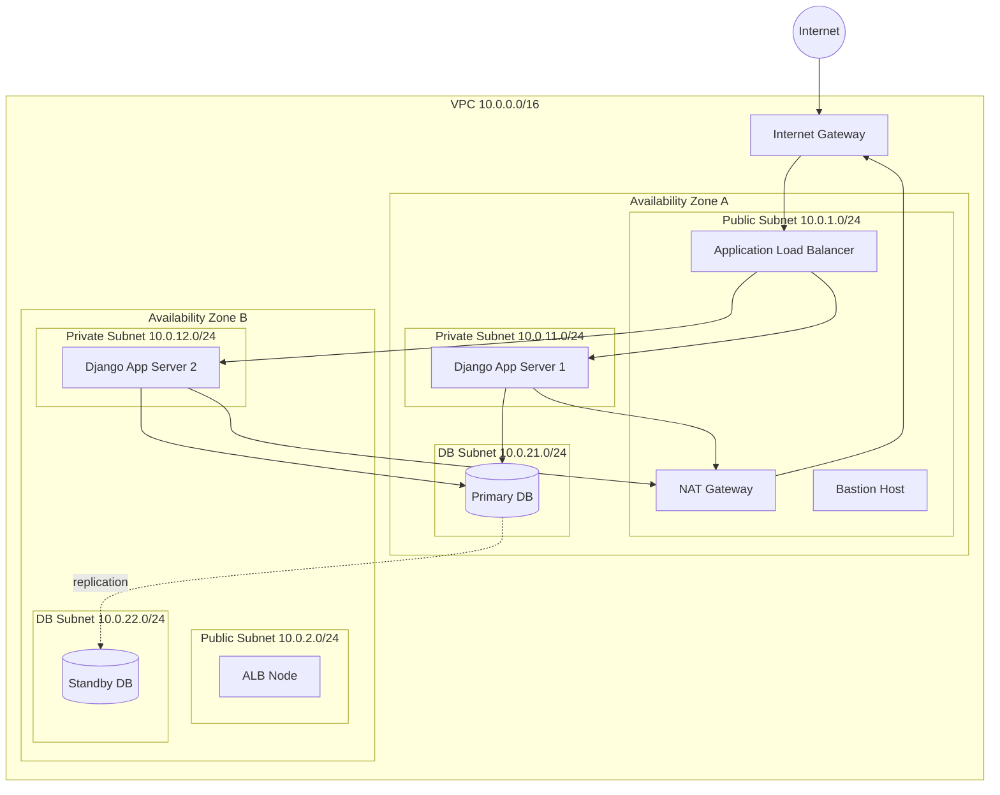
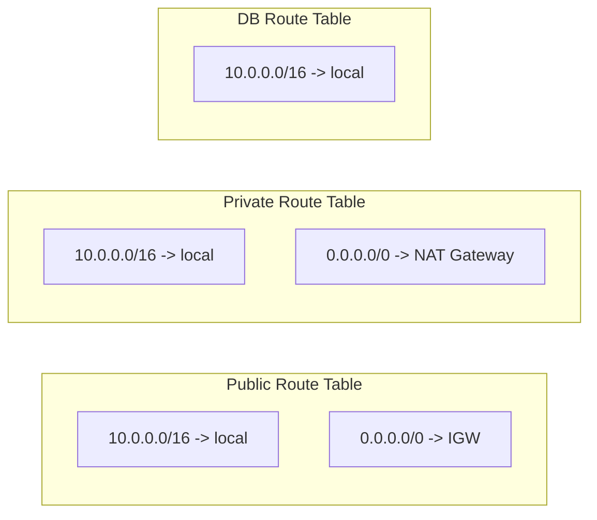
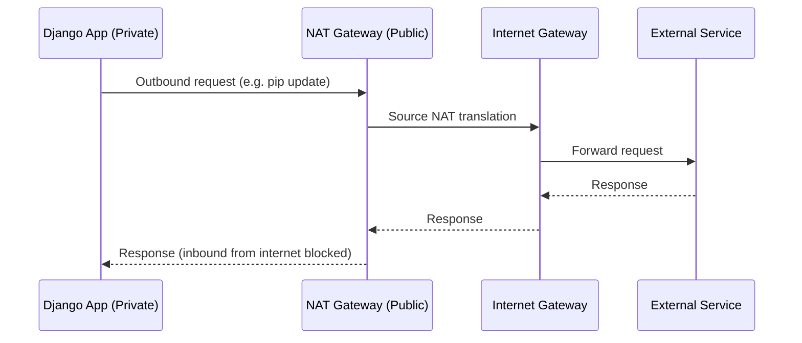
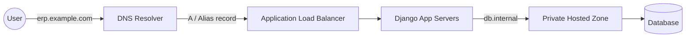
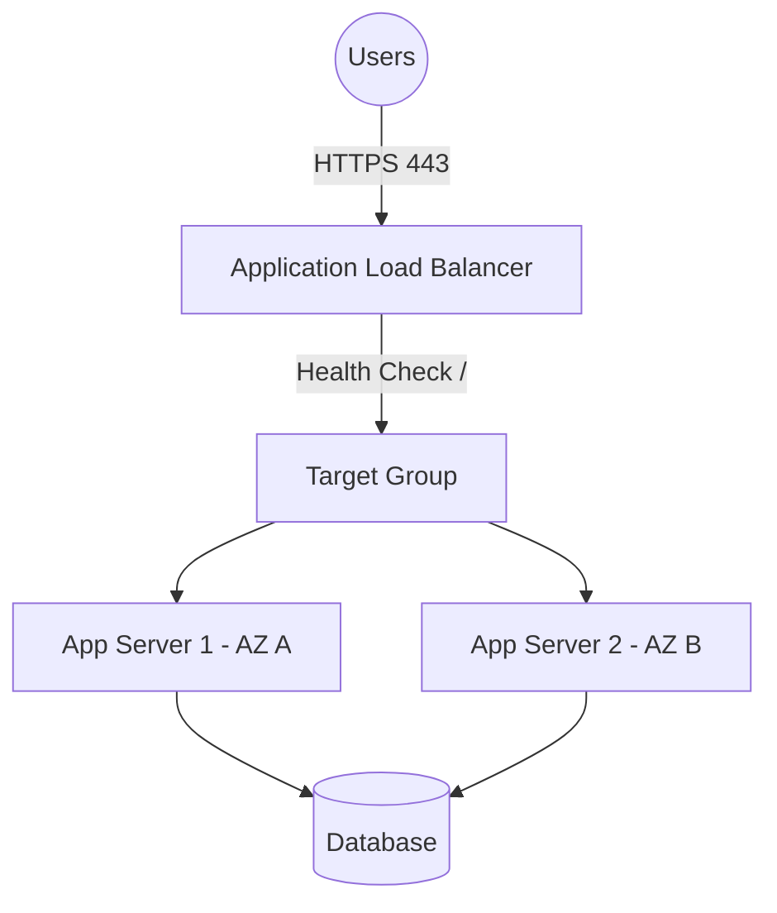
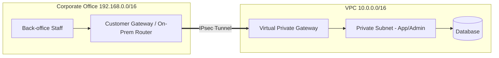
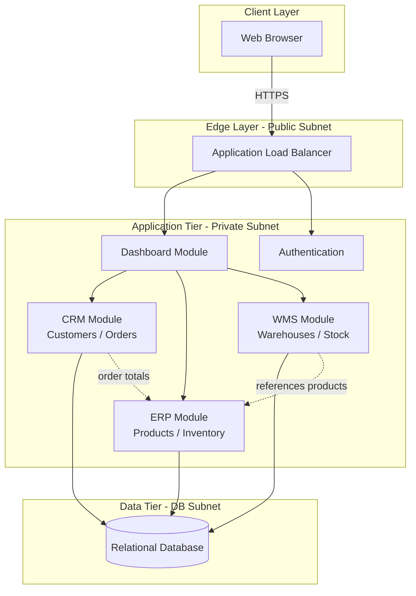

# Network Design — Cloud ERP Platform

> BTEC Unit 6: Cloud & Networking — Network Architecture Document
> Application: Cloud ERP Platform (CRM + ERP + WMS) built on Django

This document describes the target cloud network design that hosts the Django
CRM/ERP/WMS platform. It covers the Virtual Private Cloud (VPC), public and
private subnets, routing, gateways, DNS, load balancing and VPN connectivity,
and shows how the three business modules map onto the infrastructure.

---

## 1. Design Goals

| Goal | Description |
|------|-------------|
| Security | Application and database tiers isolated in private subnets, no direct internet exposure. |
| High availability | Resources spread across two Availability Zones (AZs). |
| Scalability | Application tier sits behind a load balancer in an Auto Scaling Group. |
| Controlled egress | Private resources reach the internet only through a NAT Gateway. |
| Hybrid access | Corporate office connected via a site-to-site VPN for admin/back-office traffic. |

---

## 2. VPC Architecture

The platform runs inside a single **VPC** with CIDR block `10.0.0.0/16`,
spanning two Availability Zones for resilience. Each AZ contains one public and
one private subnet.

| Component | CIDR | AZ | Purpose |
|-----------|------|----|---------|
| VPC | `10.0.0.0/16` | Region | Overall isolated network boundary |
| Public Subnet A | `10.0.1.0/24` | az-a | Load balancer, NAT GW, bastion |
| Public Subnet B | `10.0.2.0/24` | az-b | Load balancer (HA) |
| Private Subnet A | `10.0.11.0/24` | az-a | Django app servers (CRM/ERP/WMS) |
| Private Subnet B | `10.0.12.0/24` | az-b | Django app servers (HA) |
| DB Subnet A | `10.0.21.0/24` | az-a | Primary database |
| DB Subnet B | `10.0.22.0/24` | az-b | Standby database |

---

## 3. Public Subnet

The public subnets host only internet-facing or egress components:

- **Application Load Balancer (ALB)** — receives HTTPS traffic from users.
- **NAT Gateway** — provides outbound internet access for private resources.
- **Bastion Host** — controlled SSH entry point for administration.

Public subnets have a route to the **Internet Gateway** (`0.0.0.0/0 → IGW`),
which is what makes them "public". No application or database servers live here.

## 4. Private Subnet

The private subnets host the workload that must never be reached directly from
the internet:

- **Django application servers** running the CRM, ERP and WMS modules
  (Gunicorn/uWSGI behind the ALB).
- **Database subnets** hold the managed relational database (primary + standby).

Private subnets route outbound traffic (`0.0.0.0/0`) to the **NAT Gateway**, so
servers can pull OS/package/security updates without being publicly addressable.

---

## 5. Route Tables

| Route Table | Destination | Target | Attached Subnets |
|-------------|-------------|--------|------------------|
| Public RT | `10.0.0.0/16` | local | Public A, Public B |
| Public RT | `0.0.0.0/0` | Internet Gateway | Public A, Public B |
| Private RT | `10.0.0.0/16` | local | Private A, Private B |
| Private RT | `0.0.0.0/0` | NAT Gateway | Private A, Private B |
| DB RT | `10.0.0.0/16` | local | DB A, DB B |

The DB route table has **no default route** — the database tier cannot reach or
be reached from the internet at all.

---

## 6. Internet Gateway (IGW)

The Internet Gateway is attached to the VPC and is the only component that
provides bidirectional internet connectivity. It is referenced by the public
route table and is used by:

- The ALB to accept inbound user traffic.
- The NAT Gateway to forward private subnet egress traffic outward.

## 7. NAT Gateway

The NAT Gateway lives in a public subnet and allows private subnet resources to
initiate **outbound-only** connections to the internet (package updates, API
calls, license checks). Inbound connections initiated from the internet to
private resources are not possible through the NAT Gateway.

---

## 8. DNS

DNS provides name resolution for both public users and internal services.

| Layer | Mechanism | Example |
|-------|-----------|---------|
| Public DNS | Hosted zone / public records | `erp.example.com → ALB` |
| Internal DNS | Private hosted zone | `db.internal → primary DB` |
| Health-based routing | DNS health checks / failover records | Fails over to standby region |
| VPC DNS | Built-in resolver | EC2/private resource resolution |

---

## 9. Load Balancer

An **Application Load Balancer (Layer 7)** distributes inbound HTTPS traffic
across the Django application servers in both AZs. It terminates TLS, performs
health checks, and routes by path if needed (e.g. `/crm`, `/erp`, `/wms`).

| Feature | Configuration |
|---------|---------------|
| Listener | HTTPS:443 (TLS termination), HTTP:80 → redirect to 443 |
| Health check | `GET /login/` expecting HTTP 200/302 |
| Algorithm | Round robin / least outstanding requests |
| Stickiness | Cookie-based session affinity (optional) |
| Cross-zone | Enabled for even distribution |

---

## 10. VPN Connectivity

A **site-to-site VPN** connects the corporate office to the VPC over an IPsec
tunnel, allowing back-office staff to reach internal admin tooling and the
database management interface without exposing them publicly.

| Element | Description |
|---------|-------------|
| Customer Gateway | On-premise router/firewall public endpoint |
| Virtual Private Gateway | VPC-side VPN endpoint |
| Tunnels | Two redundant IPsec tunnels for HA |
| Routing | Static or BGP routes for `192.168.0.0/16 ↔ 10.0.0.0/16` |
| Use case | Admin access, DB management, internal reporting |

---

## 11. ERP, CRM and WMS Architecture

All three Django modules are deployed as part of the same application image but
are logically separated by URL namespace and database models. They share the
application tier and database, communicating internally over private subnets.

### Module interaction summary

| Module | Core models | Depends on | Network path |
|--------|-------------|-----------|--------------|
| CRM | `Customer`, `Order` | Shared DB | ALB → App → DB |
| ERP | `Product`, `Inventory` | Shared DB | ALB → App → DB |
| WMS | `Warehouse`, `StockMovement` | ERP `Product` (FK) | ALB → App → DB |
| Dashboard | aggregates counts | CRM/ERP/WMS | ALB → App → DB |

The **WMS `StockMovement` model references the ERP `Product` model**, which is
why the two modules are shown as integrated in the diagram. The CRM order
totals conceptually relate to ERP product pricing.

---

## 12. Summary

The design isolates the application and data tiers in private subnets, exposes
only the load balancer publicly, routes private egress through a NAT Gateway,
provides resilient DNS and VPN access, and spreads resources across two AZs for
high availability. This forms the foundation for the security and optimization
strategies documented in `INFRASTRUCTURE_SECURITY.md` and
`TECH_OPTIMIZATION.md`.
