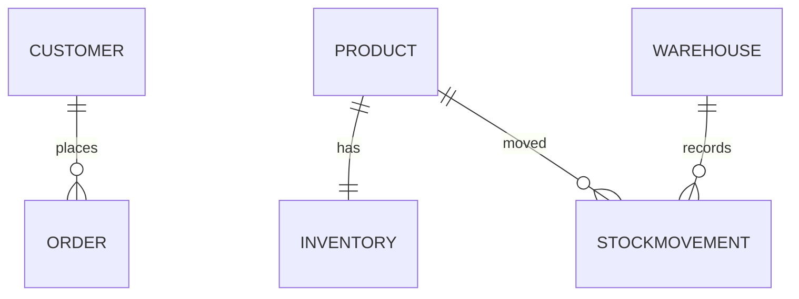

# Project Structure

> Technical reference for the Cloud ERP Platform (Django CRM + ERP + WMS).

This document describes the folder layout, Django apps, models, URL routing,
templates and static files.

---

## 1. Folder Structure

```
Networking/
├── manage.py                       # Django entry point
├── db.sqlite3                      # Dev database (created after migrate)
│
├── cloud_erp_platform/             # Project package
│   ├── settings.py                 # Installed apps, templates, auth, static
│   ├── urls.py                     # Root URL routing (includes all apps)
│   ├── wsgi.py                     # WSGI entry point
│   └── asgi.py                     # ASGI entry point
│
├── users/                          # Authentication app
│   ├── urls.py                     # login / logout routes
│   └── migrations/
│
├── dashboard/                      # Dashboard app
│   ├── views.py                    # Home view (aggregated counts)
│   ├── urls.py
│   ├── management/commands/
│   │   └── seed_data.py            # Demo admin + sample data command
│   └── migrations/
│
├── crm/                            # CRM app
│   ├── models.py                   # Customer, Order
│   ├── views.py                    # customer_list, customer_detail, order_list
│   ├── admin.py
│   ├── urls.py
│   └── migrations/
│
├── erp/                            # ERP app
│   ├── models.py                   # Product, Inventory
│   ├── views.py                    # product_list, inventory_list
│   ├── admin.py
│   ├── urls.py
│   └── migrations/
│
├── wms/                            # WMS app
│   ├── models.py                   # Warehouse, StockMovement
│   ├── views.py                    # warehouse_list, stock_movement_list
│   ├── admin.py
│   ├── urls.py
│   └── migrations/
│
├── templates/                      # Project-level templates
│   ├── base.html                   # Bootstrap 5 layout + navbar
│   ├── users/login.html
│   ├── dashboard/home.html
│   ├── crm/customer_list.html
│   ├── crm/customer_detail.html
│   ├── crm/order_list.html
│   ├── erp/product_list.html
│   ├── erp/inventory_list.html
│   ├── wms/warehouse_list.html
│   └── wms/stock_movement_list.html
│
├── static/
│   └── css/app.css                 # Custom styling overrides
│
├── docs/screenshots/               # Evidence screenshots
├── diagrams/                       # 7 Mermaid architecture diagrams
│
├── NETWORK_DESIGN.md
├── CLOUD_STRATEGY.md
├── INFRASTRUCTURE_SECURITY.md
├── TECH_OPTIMIZATION.md
├── FINAL_MISSION_REPORT.md
├── PROJECT_STRUCTURE.md
├── DEPLOYMENT_GUIDE.md
├── TESTING_REPORT.md
├── SCREENSHOT_GUIDE.md
├── ASSESSMENT_CHECKLIST.md
└── README.md
```

---

## 2. Django Apps

| App | Responsibility | Key files |
|-----|----------------|-----------|
| `cloud_erp_platform` | Project config + root URLs | `settings.py`, `urls.py` |
| `users` | Authentication (login/logout) | `urls.py` (built-in auth views) |
| `dashboard` | Landing page + seed command | `views.py`, `seed_data.py` |
| `crm` | Customer relationship management | `models.py`, `views.py` |
| `erp` | Products + inventory | `models.py`, `views.py` |
| `wms` | Warehouses + stock movements | `models.py`, `views.py` |

All five local apps are registered in `INSTALLED_APPS` in `settings.py`.

---

## 3. Models

### CRM (`crm/models.py`)

| Model | Fields | Relationships |
|-------|--------|---------------|
| `Customer` | name, email, phone, company, address, created_at | has many `Order` |
| `Order` | reference (unique), total_amount, status, created_at | FK → `Customer` |

### ERP (`erp/models.py`)

| Model | Fields | Relationships |
|-------|--------|---------------|
| `Product` | name, sku (unique), description, price, created_at | has one `Inventory` |
| `Inventory` | quantity, reorder_level, updated_at, `needs_reorder` (property) | OneToOne → `Product` |

### WMS (`wms/models.py`)

| Model | Fields | Relationships |
|-------|--------|---------------|
| `Warehouse` | name, code (unique), location, capacity, created_at | has many `StockMovement` |
| `StockMovement` | movement_type (in/out/transfer), quantity, note, created_at | FK → `Warehouse`, FK → `erp.Product` |



> Cross-module link: `wms.StockMovement.product` is a foreign key to
> `erp.Product`, integrating the WMS and ERP modules.

---

## 4. URLs

### Root (`cloud_erp_platform/urls.py`)

| Prefix | Include |
|--------|---------|
| `admin/` | `admin.site.urls` |
| `` (root) | `dashboard.urls` |
| `` (root) | `users.urls` |
| `crm/` | `crm.urls` |
| `erp/` | `erp.urls` |
| `wms/` | `wms.urls` |

### App routes

| App | Name | Path | View |
|-----|------|------|------|
| dashboard | `dashboard:home` | `/` | `home` |
| users | `login` | `/login/` | `LoginView` |
| users | `logout` | `/logout/` | `LogoutView` |
| crm | `crm:customer_list` | `/crm/customers/` | `customer_list` |
| crm | `crm:customer_detail` | `/crm/customers/<int:pk>/` | `customer_detail` |
| crm | `crm:order_list` | `/crm/orders/` | `order_list` |
| erp | `erp:product_list` | `/erp/products/` | `product_list` |
| erp | `erp:inventory_list` | `/erp/inventory/` | `inventory_list` |
| wms | `wms:warehouse_list` | `/wms/warehouses/` | `warehouse_list` |
| wms | `wms:stock_movement_list` | `/wms/movements/` | `stock_movement_list` |

All module views are protected with `@login_required`.

---

## 5. Templates

Templates use a single base layout with template inheritance.

| Template | Extends | Purpose |
|----------|---------|---------|
| `base.html` | — | HTML shell, Bootstrap 5, responsive navbar, messages, footer |
| `users/login.html` | `base.html` | Login form |
| `dashboard/home.html` | `base.html` | Module cards with counts |
| `crm/customer_list.html` | `base.html` | Customer table |
| `crm/customer_detail.html` | `base.html` | Customer + orders |
| `crm/order_list.html` | `base.html` | Order table |
| `erp/product_list.html` | `base.html` | Product table |
| `erp/inventory_list.html` | `base.html` | Inventory table |
| `wms/warehouse_list.html` | `base.html` | Warehouse table |
| `wms/stock_movement_list.html` | `base.html` | Stock movement table |

`TEMPLATES['DIRS']` is set to `BASE_DIR / 'templates'` in `settings.py`.

The navbar provides dropdown menus for CRM, ERP and WMS, plus the logged-in
user's name and a logout button (POST form).

---

## 6. Static Files

| Path | Purpose |
|------|---------|
| `static/css/app.css` | Custom CSS overrides |
| Bootstrap 5 (CDN) | Layout + components |
| Bootstrap Icons (CDN) | Icons used in navbar/cards |

`STATIC_URL = 'static/'` and `STATICFILES_DIRS = [BASE_DIR / 'static']` are
configured in `settings.py`. Bootstrap is loaded from a CDN in `base.html`, so
the styled UI requires an internet connection at runtime.

---

## 7. Configuration Highlights (`settings.py`)

| Setting | Value |
|---------|-------|
| `INSTALLED_APPS` | + users, dashboard, crm, erp, wms |
| `TEMPLATES['DIRS']` | `BASE_DIR / 'templates'` |
| `STATICFILES_DIRS` | `BASE_DIR / 'static'` |
| `DEFAULT_AUTO_FIELD` | `BigAutoField` |
| `LOGIN_URL` | `login` |
| `LOGIN_REDIRECT_URL` | `dashboard:home` |
| `LOGOUT_REDIRECT_URL` | `login` |
| `DATABASES` | SQLite (development) |
