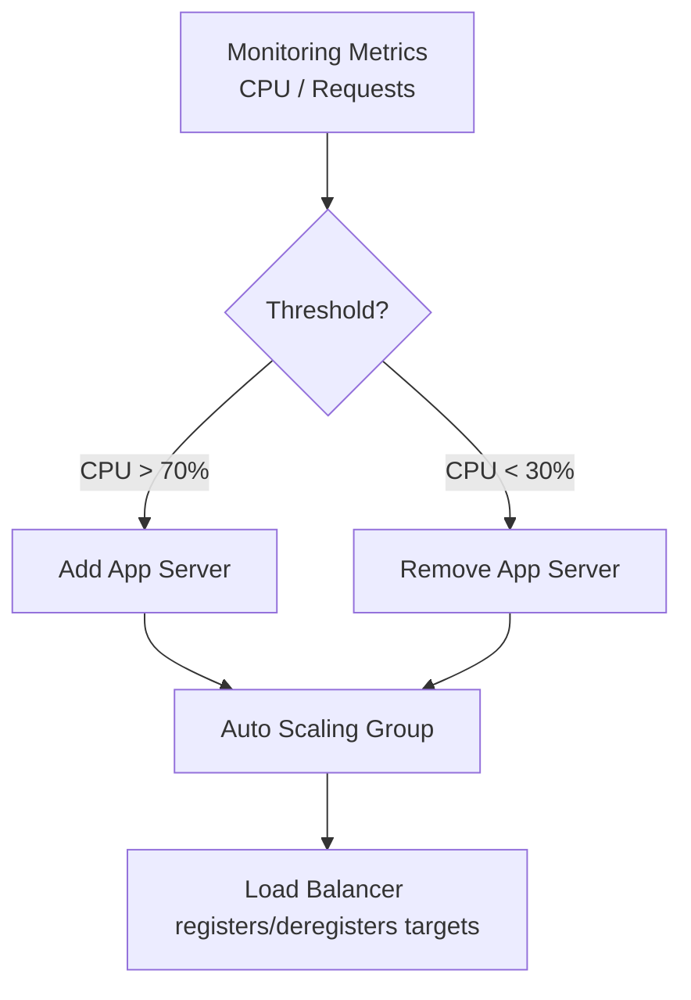
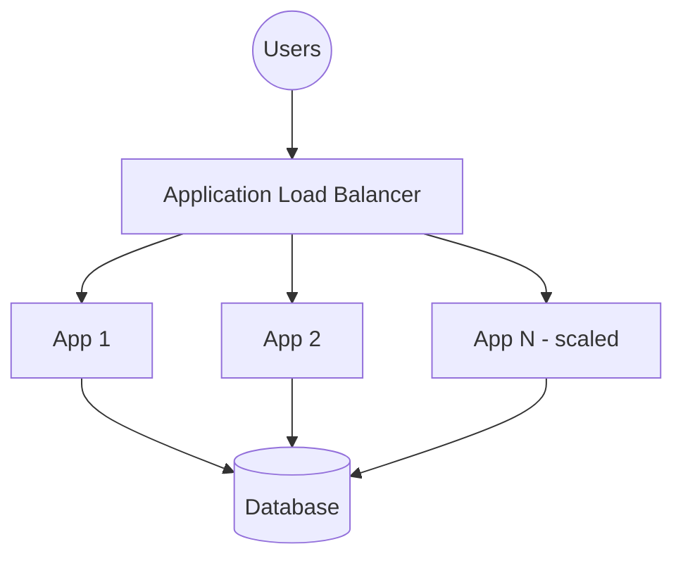
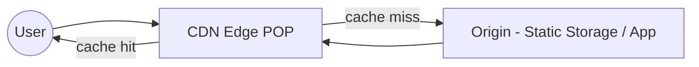
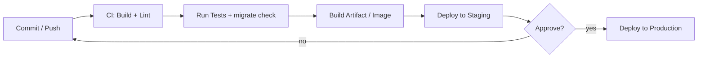
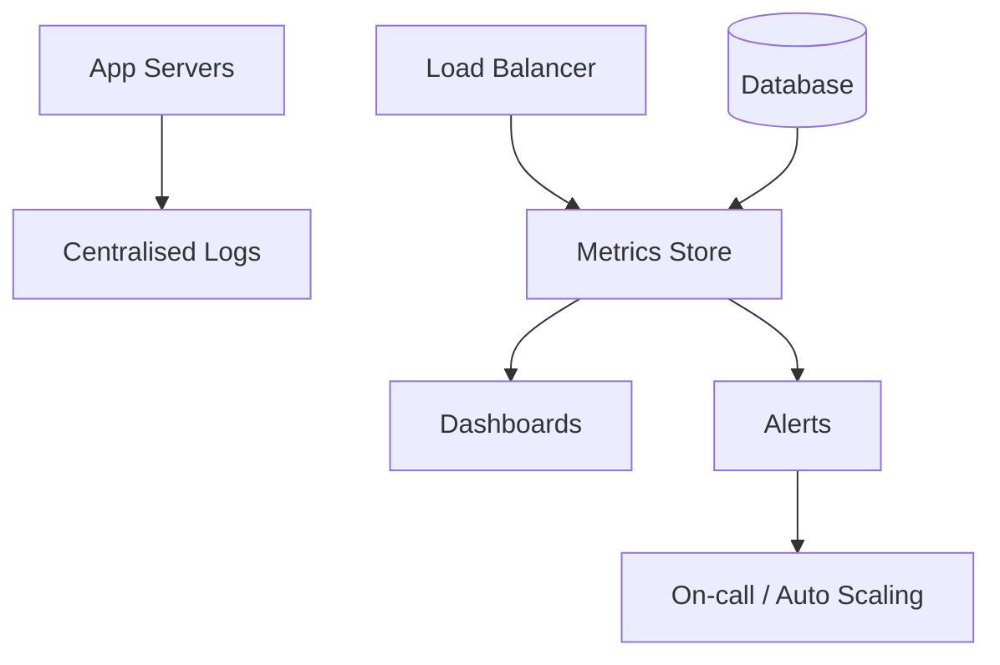
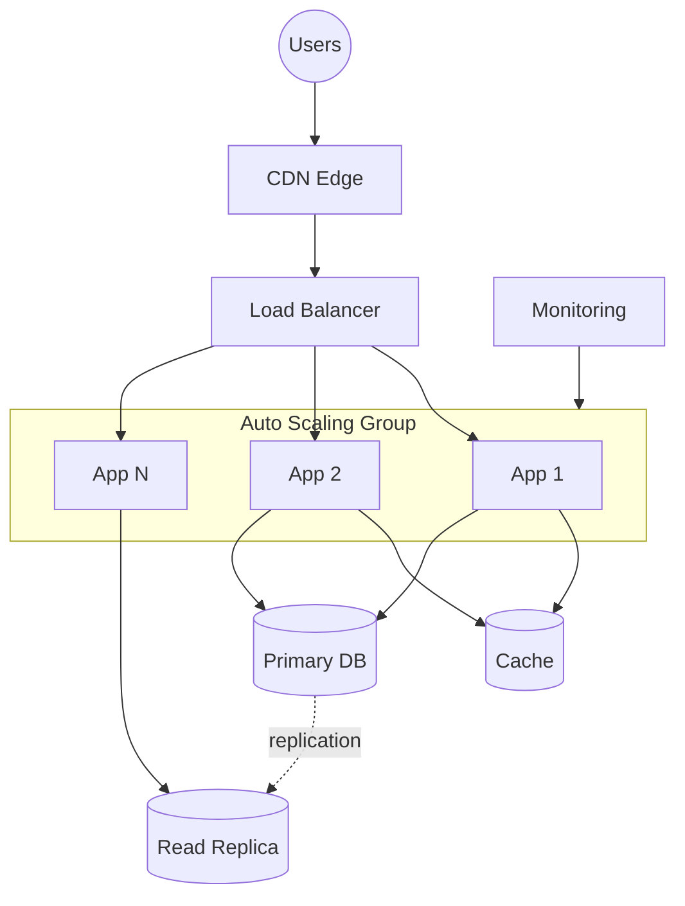

# Technology Optimization

> BTEC Unit 6 — Learning Aim D
> Criteria covered: **D.P8**
> Application context: Cloud ERP Platform (Django CRM + ERP + WMS)

This document explains the techniques used to optimise the performance and
scalability of the Cloud ERP Platform: auto scaling, load balancing, CDN,
CI/CD, monitoring and network optimisation, with supporting performance and
scalability tables and Mermaid diagrams.

---

## Criterion Coverage Map

| Criterion | Requirement | Section |
|-----------|-------------|---------|
| **D.P8** | Configure/optimise the network solution to improve performance and scalability | All sections |

---

## 1. Auto Scaling

Auto Scaling automatically adjusts the number of Django application servers
based on demand, keeping performance stable while controlling cost.

| Setting | Value |
|---------|-------|
| Minimum instances | 2 (one per AZ) |
| Maximum instances | 8 |
| Scale-out trigger | Avg CPU > 70% for 3 min |
| Scale-in trigger | Avg CPU < 30% for 10 min |
| Health check | ALB target health |
| Cooldown | 300 seconds |

---

## 2. Load Balancing

The Application Load Balancer distributes requests across healthy app servers
and integrates with Auto Scaling.

| Feature | Benefit |
|---------|---------|
| Health checks | Removes unhealthy nodes automatically. |
| Cross-zone balancing | Even distribution across AZs. |
| Connection draining | Graceful removal during scale-in. |
| Least outstanding requests | Routes to least busy server. |

---

## 3. CDN (Content Delivery Network)

A CDN caches static assets (CSS, JS, images) at global edge locations, reducing
latency and offloading the application servers.

| Asset type | Served by | Cached |
|------------|-----------|--------|
| Bootstrap / icons | CDN (jsDelivr) | Yes |
| App static (`/static/`) | CDN → origin storage | Yes |
| Dynamic pages | App servers | No (or short TTL) |

---

## 4. CI/CD

A CI/CD pipeline automates testing and deployment, improving reliability and
release speed.

| Stage | Action |
|-------|--------|
| Build | Install deps, collect static. |
| Test | `python manage.py check`, unit tests, migration check. |
| Deploy (staging) | Rolling deploy to staging environment. |
| Deploy (prod) | Blue/green or rolling deploy behind ALB, zero downtime. |

---

## 5. Monitoring

Monitoring provides the metrics that drive Auto Scaling and alerting.

| Metric | Tool layer | Action |
|--------|-----------|--------|
| CPU / memory | Infrastructure monitoring | Trigger scaling. |
| Request latency | ALB metrics | Alert if > threshold. |
| Error rate (5xx) | App + ALB logs | Page on-call. |
| DB connections | Database metrics | Detect saturation. |
| Health checks | ALB target group | Replace bad nodes. |

---

## 6. Network Optimization

| Technique | Effect |
|-----------|--------|
| Connection pooling | Reuses DB connections, lowers latency. |
| Keep-alive / HTTP/2 | Fewer TCP handshakes. |
| Gzip / Brotli compression | Smaller payloads, faster transfer. |
| Caching (CDN + app cache) | Fewer origin/DB hits. |
| Same-AZ routing where possible | Reduces cross-AZ latency. |
| Query optimisation (`select_related`) | Fewer DB round-trips (used in views). |

> Note: the Django views already use `select_related()` for orders, inventory
> and stock movements to avoid N+1 query problems.

---

## 7. Performance Tables

### 7.1 Response time under load (illustrative targets)

| Concurrent users | Single server (before) | Optimised cluster (after) |
|------------------|------------------------|---------------------------|
| 50 | 220 ms | 110 ms |
| 200 | 850 ms | 180 ms |
| 500 | 2,400 ms (errors) | 260 ms |
| 1,000 | timeouts | 340 ms |

### 7.2 Throughput

| Configuration | Requests/sec | Error rate |
|---------------|--------------|------------|
| Single server | ~120 | rising > 200 users |
| 2 servers + ALB | ~300 | < 0.1% |
| Auto-scaled (up to 8) + CDN | ~1,200 | < 0.1% |

### 7.3 Optimisation impact summary

| Optimisation | Latency | Throughput | Cost efficiency |
|--------------|---------|------------|-----------------|
| Load balancing | ↓ | ↑↑ | ↑ |
| Auto scaling | ↓ (under load) | ↑↑ | ↑↑ |
| CDN | ↓↓ (static) | ↑ | ↑ |
| Caching/pooling | ↓ | ↑ | ↑ |

---

## 8. Scalability Tables

### 8.1 Vertical vs horizontal scaling

| Dimension | Vertical (bigger server) | Horizontal (more servers) |
|-----------|--------------------------|---------------------------|
| Method | Increase CPU/RAM | Add instances to ASG |
| Limit | Hardware ceiling | Near-unlimited |
| Downtime | Often required | None (rolling) |
| Used here | DB tier (some) | App tier (primary) |

### 8.2 Scaling behaviour

| Load level | Instances | CPU avg | Action |
|------------|-----------|---------|--------|
| Low (night) | 2 | 15% | Scale in to min |
| Normal (day) | 3–4 | 45% | Steady |
| Peak (campaign) | 6–8 | 65% | Scale out |
| Spike | 8 (max) | 80% | Queue / CDN absorbs static |

### 8.3 Component scalability

| Component | Scalability approach |
|-----------|----------------------|
| App tier | Horizontal via Auto Scaling Group |
| Database | Read replicas + vertical scaling |
| Static assets | CDN edge caching (effectively infinite) |
| Load balancer | Managed, scales automatically |

---

## 9. Optimised Architecture Diagram

---

## 10. Summary

By combining auto scaling, load balancing, a CDN, caching, CI/CD automation,
monitoring and network-level optimisations, the platform maintains low latency
and high throughput as demand grows, while keeping costs proportional to usage.
The performance and scalability tables show a clear improvement over a single
server baseline, satisfying **D.P8**.
