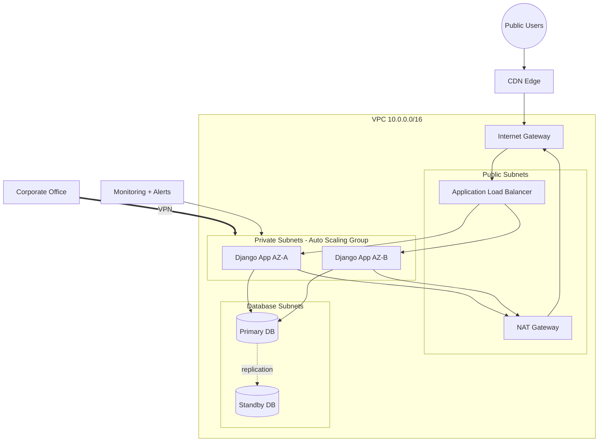

# Cloud Architecture

End-to-end view of the Cloud ERP Platform on a multi-AZ VPC.

```mermaid
graph TB
    Users((Public Users)) --> CDN[CDN Edge]
    CDN --> IGW[Internet Gateway]
    IGW --> ALB[Application Load Balancer]

    subgraph VPC["VPC 10.0.0.0/16"]
        subgraph Public["Public Subnets"]
            ALB
            NAT[NAT Gateway]
        end
        subgraph Private["Private Subnets - Auto Scaling Group"]
            App1[Django App AZ-A]
            App2[Django App AZ-B]
        end
        subgraph Data["Database Subnets"]
            DBP[(Primary DB)]
            DBS[(Standby DB)]
        end
        ALB --> App1
        ALB --> App2
        App1 --> DBP
        App2 --> DBP
        DBP -. replication .-> DBS
        App1 --> NAT
        App2 --> NAT
        NAT --> IGW
    end

    Office[Corporate Office] == VPN ==> Private
    Mon[Monitoring + Alerts] --> Private
```
