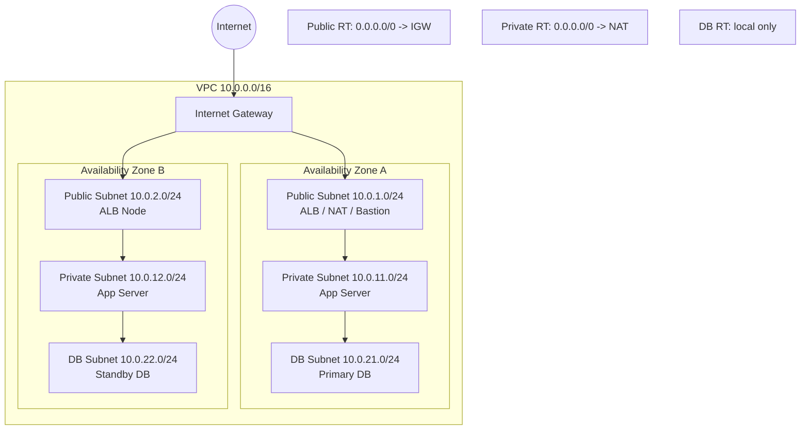

# Network Topology

Subnet and routing layout across two Availability Zones.

```mermaid
graph TB
    Internet((Internet)) --> IGW[Internet Gateway]

    subgraph VPC["VPC 10.0.0.0/16"]
        subgraph AZA["Availability Zone A"]
            PubA[Public Subnet 10.0.1.0/24<br/>ALB / NAT / Bastion]
            PrivA[Private Subnet 10.0.11.0/24<br/>App Server]
            DBA[DB Subnet 10.0.21.0/24<br/>Primary DB]
        end
        subgraph AZB["Availability Zone B"]
            PubB[Public Subnet 10.0.2.0/24<br/>ALB Node]
            PrivB[Private Subnet 10.0.12.0/24<br/>App Server]
            DBB[DB Subnet 10.0.22.0/24<br/>Standby DB]
        end

        IGW --> PubA
        IGW --> PubB
        PubA --> PrivA --> DBA
        PubB --> PrivB --> DBB
    end

    RT1[Public RT: 0.0.0.0/0 -> IGW]
    RT2[Private RT: 0.0.0.0/0 -> NAT]
    RT3[DB RT: local only]
```
