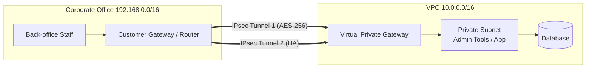
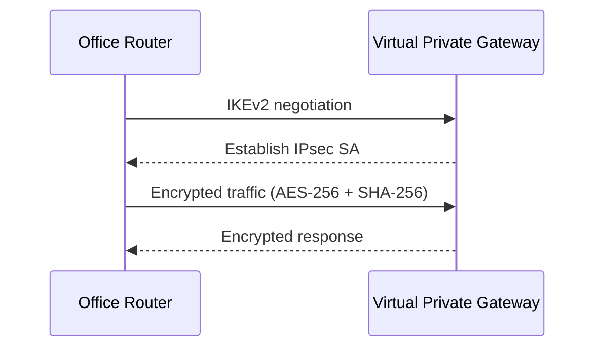

# VPN Architecture

Site-to-site IPsec VPN connecting the corporate office to the VPC.

```mermaid
graph LR
    subgraph Office["Corporate Office 192.168.0.0/16"]
        Admin[Back-office Staff]
        CGW[Customer Gateway / Router]
    end

    subgraph Cloud["VPC 10.0.0.0/16"]
        VGW[Virtual Private Gateway]
        Priv[Private Subnet<br/>Admin Tools / App]
        DB[(Database)]
    end

    Admin --> CGW
    CGW == "IPsec Tunnel 1 (AES-256)" ==> VGW
    CGW == "IPsec Tunnel 2 (HA)" ==> VGW
    VGW --> Priv
    Priv --> DB
```

```mermaid
sequenceDiagram
    participant O as Office Router
    participant V as Virtual Private Gateway
    O->>V: IKEv2 negotiation
    V-->>O: Establish IPsec SA
    O->>V: Encrypted traffic (AES-256 + SHA-256)
    V-->>O: Encrypted response
```
