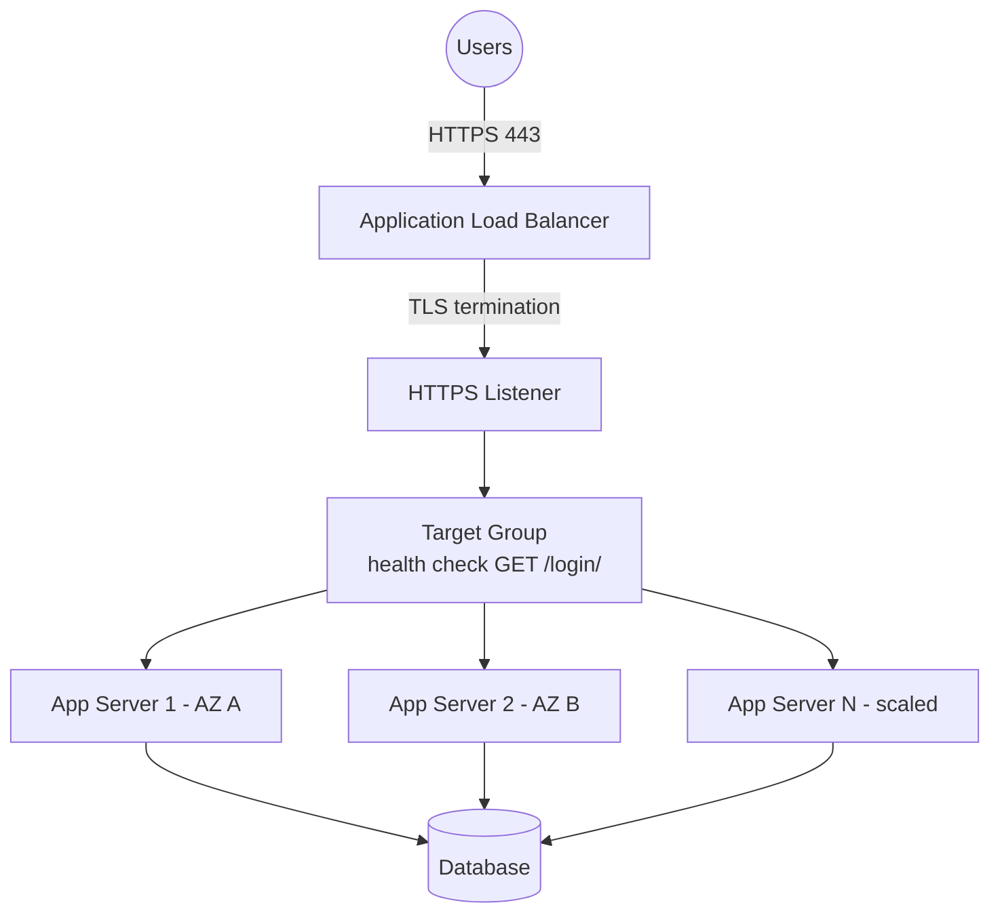
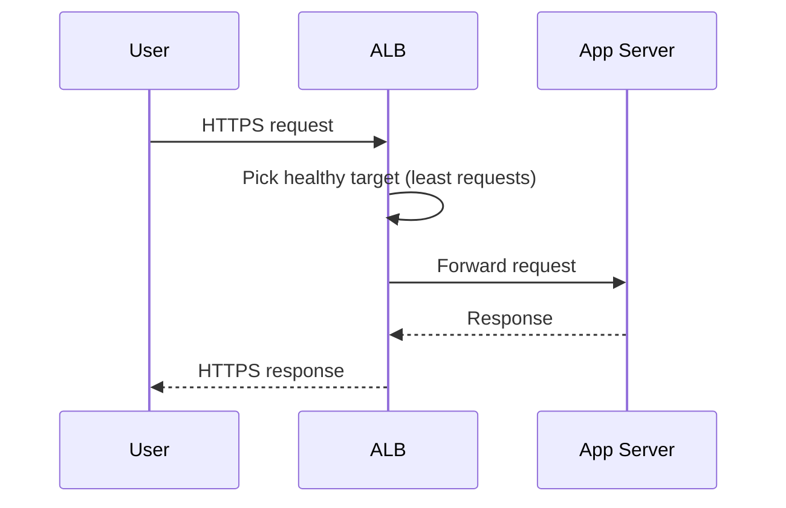

# Load Balancer Architecture

Application Load Balancer distributing traffic across app servers.

```mermaid
graph TB
    Users((Users)) -->|HTTPS 443| ALB[Application Load Balancer]
    ALB -->|TLS termination| Listener[HTTPS Listener]
    Listener --> TG[Target Group<br/>health check GET /login/]
    TG --> App1[App Server 1 - AZ A]
    TG --> App2[App Server 2 - AZ B]
    TG --> App3[App Server N - scaled]
    App1 --> DB[(Database)]
    App2 --> DB
    App3 --> DB
```

```mermaid
sequenceDiagram
    participant U as User
    participant A as ALB
    participant S as App Server
    U->>A: HTTPS request
    A->>A: Pick healthy target (least requests)
    A->>S: Forward request
    S-->>A: Response
    A-->>U: HTTPS response
```
