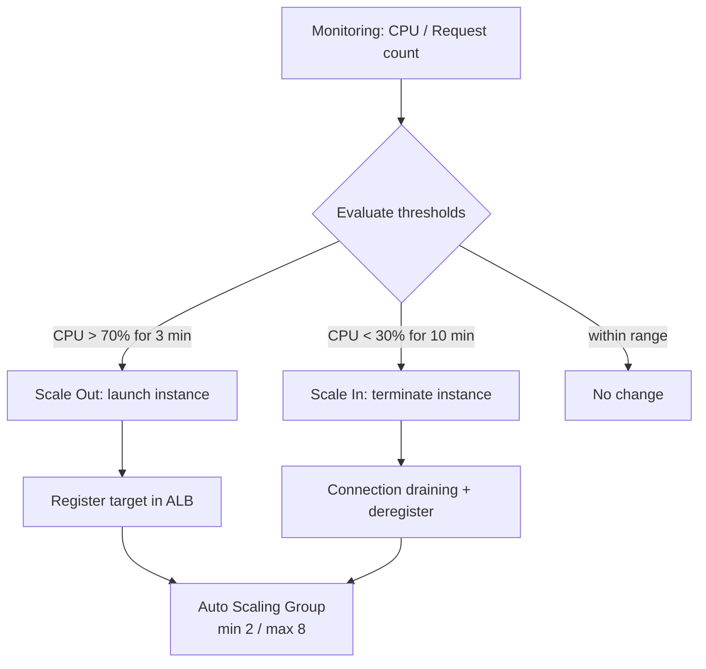
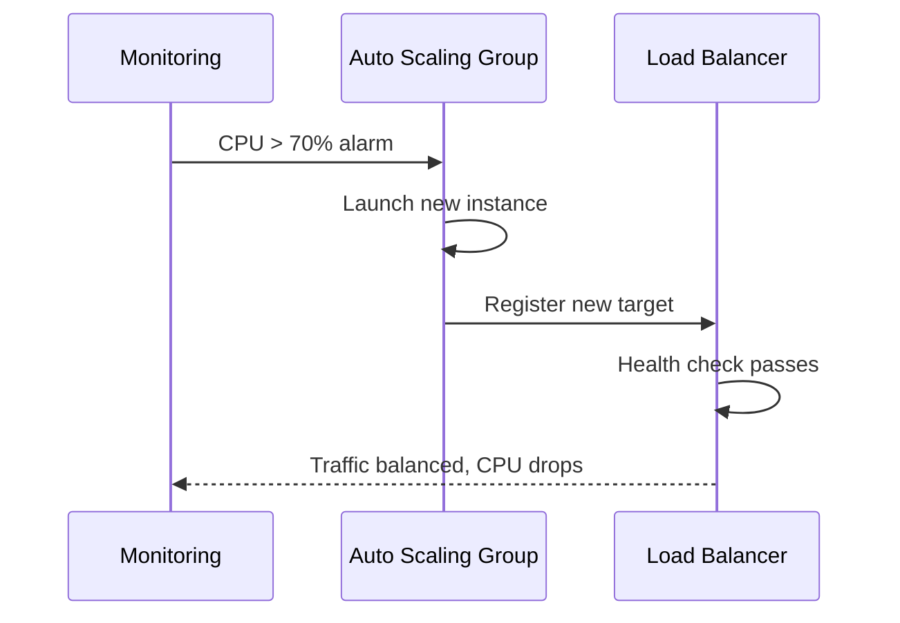

# Auto Scaling Workflow

How the Auto Scaling Group reacts to load.

```mermaid
graph TB
    Metrics[Monitoring: CPU / Request count] --> Decision{Evaluate thresholds}
    Decision -->|CPU > 70% for 3 min| Out[Scale Out: launch instance]
    Decision -->|CPU < 30% for 10 min| In[Scale In: terminate instance]
    Decision -->|within range| Hold[No change]
    Out --> Register[Register target in ALB]
    In --> Drain[Connection draining + deregister]
    Register --> ASG[Auto Scaling Group<br/>min 2 / max 8]
    Drain --> ASG
```

```mermaid
sequenceDiagram
    participant CW as Monitoring
    participant ASG as Auto Scaling Group
    participant ALB as Load Balancer
    CW->>ASG: CPU > 70% alarm
    ASG->>ASG: Launch new instance
    ASG->>ALB: Register new target
    ALB->>ALB: Health check passes
    ALB-->>CW: Traffic balanced, CPU drops
```
