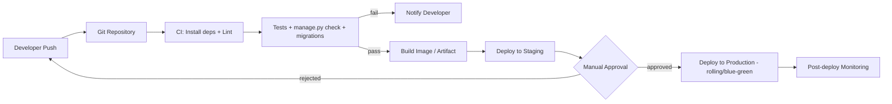
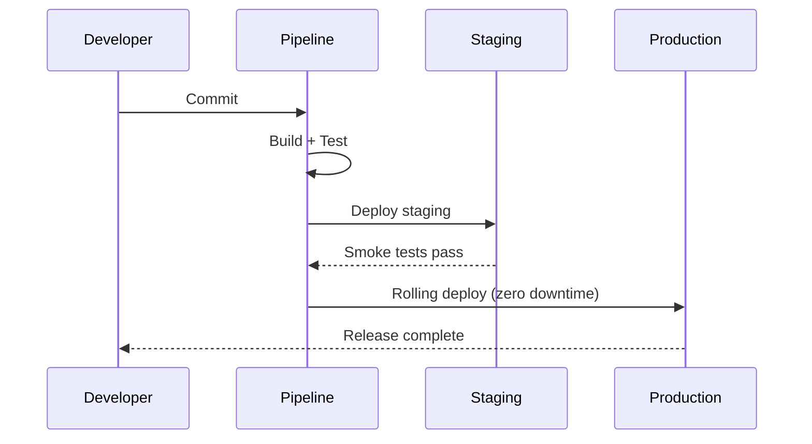

# CI/CD Workflow

Automated build, test and deployment pipeline.

```mermaid
graph LR
    Dev[Developer Push] --> Repo[Git Repository]
    Repo --> CI[CI: Install deps + Lint]
    CI --> Test[Tests + manage.py check + migrations]
    Test -->|fail| Notify[Notify Developer]
    Test -->|pass| Build[Build Image / Artifact]
    Build --> Stage[Deploy to Staging]
    Stage --> Gate{Manual Approval}
    Gate -->|approved| Prod[Deploy to Production - rolling/blue-green]
    Gate -->|rejected| Dev
    Prod --> Monitor[Post-deploy Monitoring]
```

```mermaid
sequenceDiagram
    participant D as Developer
    participant P as Pipeline
    participant S as Staging
    participant Pr as Production
    D->>P: Commit
    P->>P: Build + Test
    P->>S: Deploy staging
    S-->>P: Smoke tests pass
    P->>Pr: Rolling deploy (zero downtime)
    Pr-->>D: Release complete
```
