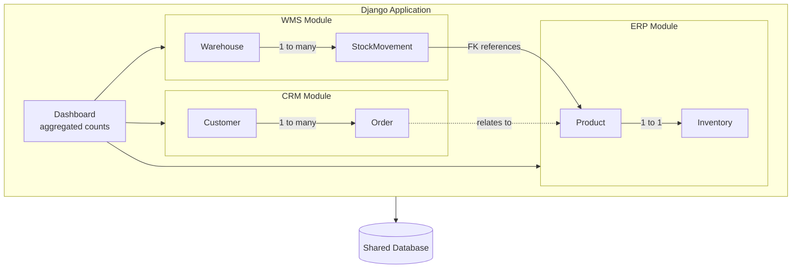
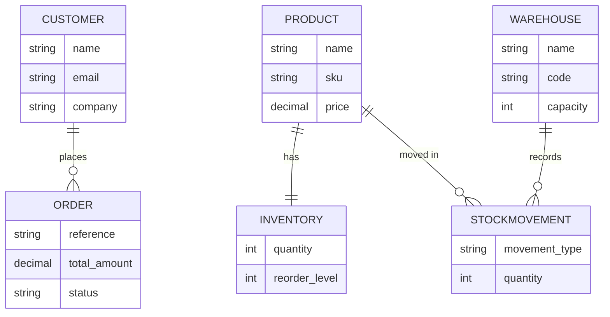

# ERP / CRM / WMS Integration

How the three Django modules relate and share data.

```mermaid
graph TB
    subgraph App["Django Application"]
        Dash[Dashboard<br/>aggregated counts]
        subgraph CRM["CRM Module"]
            Customer[Customer]
            Order[Order]
        end
        subgraph ERP["ERP Module"]
            Product[Product]
            Inventory[Inventory]
        end
        subgraph WMS["WMS Module"]
            Warehouse[Warehouse]
            Stock[StockMovement]
        end
    end

    Customer -->|1 to many| Order
    Product -->|1 to 1| Inventory
    Warehouse -->|1 to many| Stock
    Stock -->|FK references| Product
    Order -. relates to .-> Product

    Dash --> CRM
    Dash --> ERP
    Dash --> WMS

    App --> DB[(Shared Database)]
```

```mermaid
erDiagram
    CUSTOMER ||--o{ ORDER : places
    PRODUCT ||--|| INVENTORY : has
    WAREHOUSE ||--o{ STOCKMOVEMENT : records
    PRODUCT ||--o{ STOCKMOVEMENT : "moved in"
    CUSTOMER {
        string name
        string email
        string company
    }
    ORDER {
        string reference
        decimal total_amount
        string status
    }
    PRODUCT {
        string name
        string sku
        decimal price
    }
    INVENTORY {
        int quantity
        int reorder_level
    }
    WAREHOUSE {
        string name
        string code
        int capacity
    }
    STOCKMOVEMENT {
        string movement_type
        int quantity
    }
```
